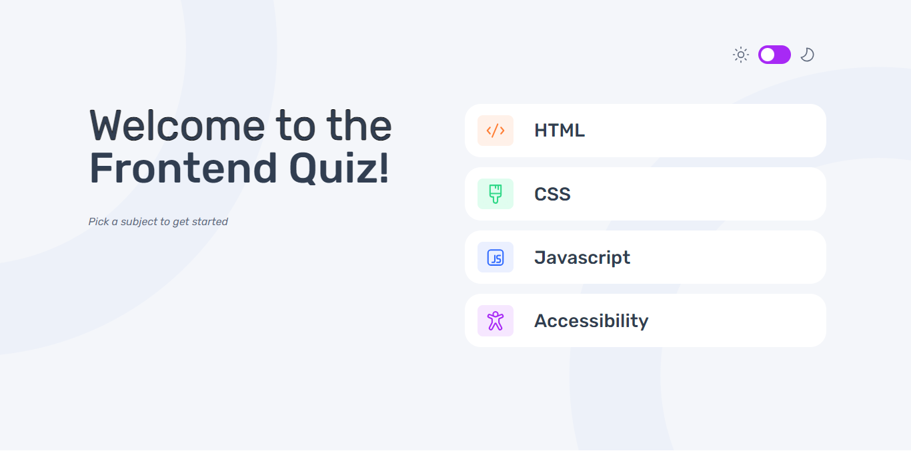
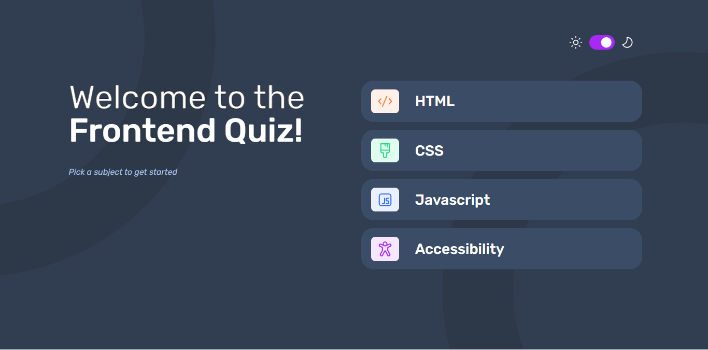
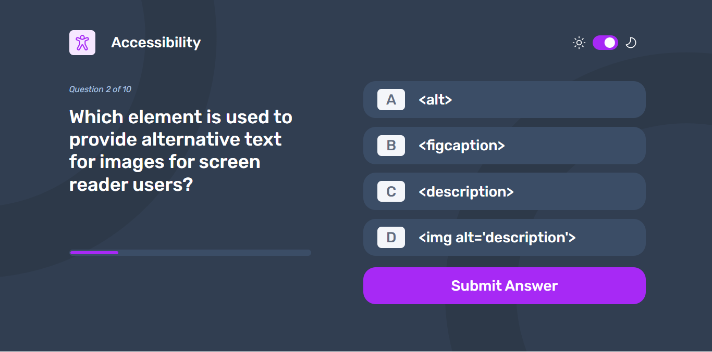
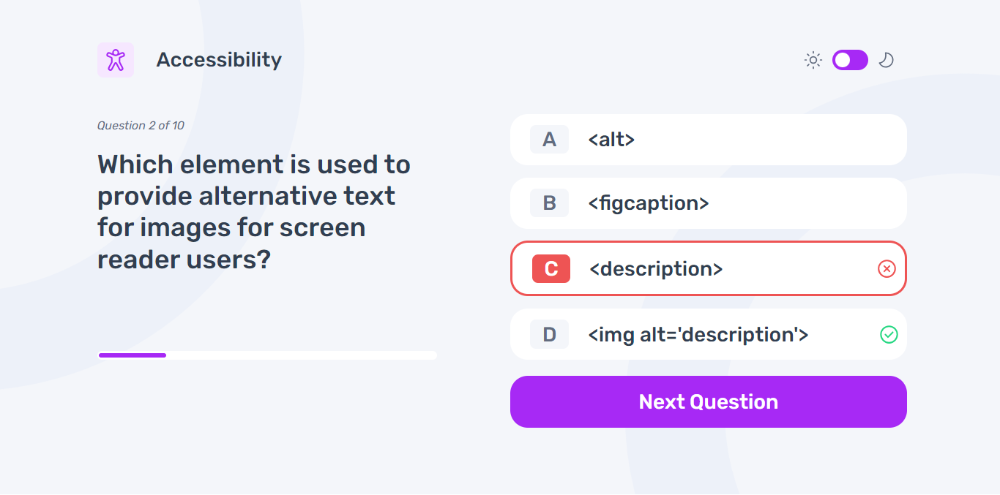
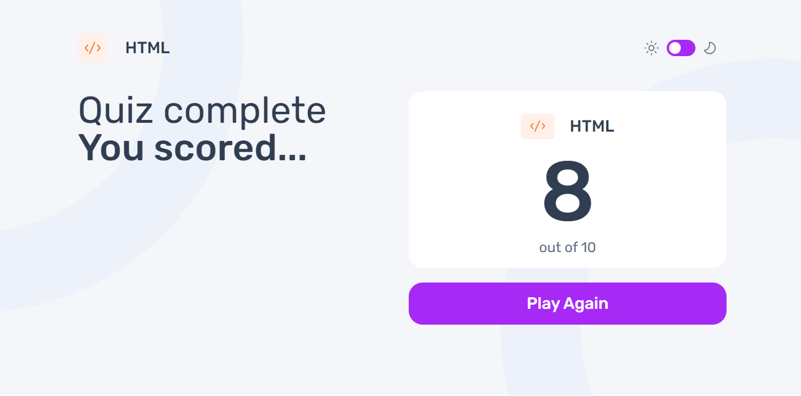

# Frontend Mentor - Frontend quiz app solution

This is a solution to the [Frontend quiz app challenge on Frontend Mentor](https://www.frontendmentor.io/challenges/frontend-quiz-app-BE7xkzXQnU). Frontend Mentor challenges help you improve your coding skills by building realistic projects.

## Table of contents

- [Overview](#overview)
    - [The challenge](#the-challenge)
    - [Screenshot](#screenshot)
    - [Links](#links)
- [My process](#my-process)
    - [Built with](#built-with)
    - [What I learned](#what-i-learned)
    - [Continued development](#continued-development)
    - [Useful resources](#useful-resources)
- [Author](#author)


## Overview

### The challenge

Users should be able to:

- Select a quiz subject
- Select a single answer from each question from a choice of four
- See an error message when trying to submit an answer without making a selection
- See if they have made a correct or incorrect choice when they submit an answer
- Move on to the next question after seeing the question result
- See a completed state with the score after the final question
- Play again to choose another subject
- View the optimal layout for the interface depending on their device's screen size
- See hover and focus states for all interactive elements on the page
- Navigate the entire app only using their keyboard
- **Bonus**: Change the app's theme between light and dark

### Screenshot

  






### Links
- Live Site URL: [QuizApp](https://frontend-quiz-app-psi.vercel.app/)

## My process
I made use of gitflow throughout the process of creating this app. Making series of commits at each juncture till the project was completed.
### Built with

- Semantic HTML5 markup
- CSS custom properties
- Flexbox
- Mobile-first workflow
- [React](https://reactjs.org/) - JS library
- [Styled Components](https://styled-components.com/) - For styles

### What I learned

I have learnt a lot about react, especially styled-components and how to use them with props. 
I also learnt how use reacts router to navigate through different pages or screens


```ts
const OptionButton = styled.button<OptionButtonProps>`
                                   background-color: ${(props) => props.theme.colors.button};
font-family: "Rubik Medium", serif;
font-size: 28px;
color: ${(props) => props.theme.colors.font};
line-height: 90%;
text-align: left;
flex: 1;
width: 100%;
height: 21%;
border-width: 0;
border-radius: 24px;
box-shadow: ${(props) => props.theme.colors.buttonShadow};
display: flex;
align-items: center;
justify-content: flex-start;
border: ${({ selected_option, _option, is_correct }) => {
    if (selected_option === _option) {
        if (is_correct === null) {
            return "3px solid #a729f5";
        } else {
            return is_correct ? "3px solid #26d782" : "3px solid #ee5454;";
        }
    }
    return "";
}};
}`
```
```js
<GlobalStyles/>
<BrowserRouter>
  <Routes>
    <Route path="/" element={<Layout toggleTheme={toggleTheme} isDarkMode={isDarkMode} />}>
      <Route index element={<Start/>}/>
      <Route path="pages/HTMLQuiz" element={<HTMLQuiz/>}/>
      <Route path="pages/CSSQuiz/" element={<CSSQuiz/>}/>
      <Route path="pages/JavascriptQuiz" element={<JavaScriptQuiz/>}/>
      <Route path="pages/AccessibilityQuiz" element={<AccessibilityQuiz/>}/>
    </Route>
  </Routes>
</BrowserRouter>
```


### Continued development

I would like to focus and keep working on how to use the different React hooks.

### Useful resources

- [W3Schools](https://www.w3schools.com/react/) - I used resources from W#Schools to ease into react as beginner. It was very insightful, and I'll recommend it to anyone who would like to start React.


## Author

- Website - [Andrew Appah](https://www.github.com/drako02)
- Twitter - [@Dark_0ut] (www.twitter.com/Dark_0ut)

